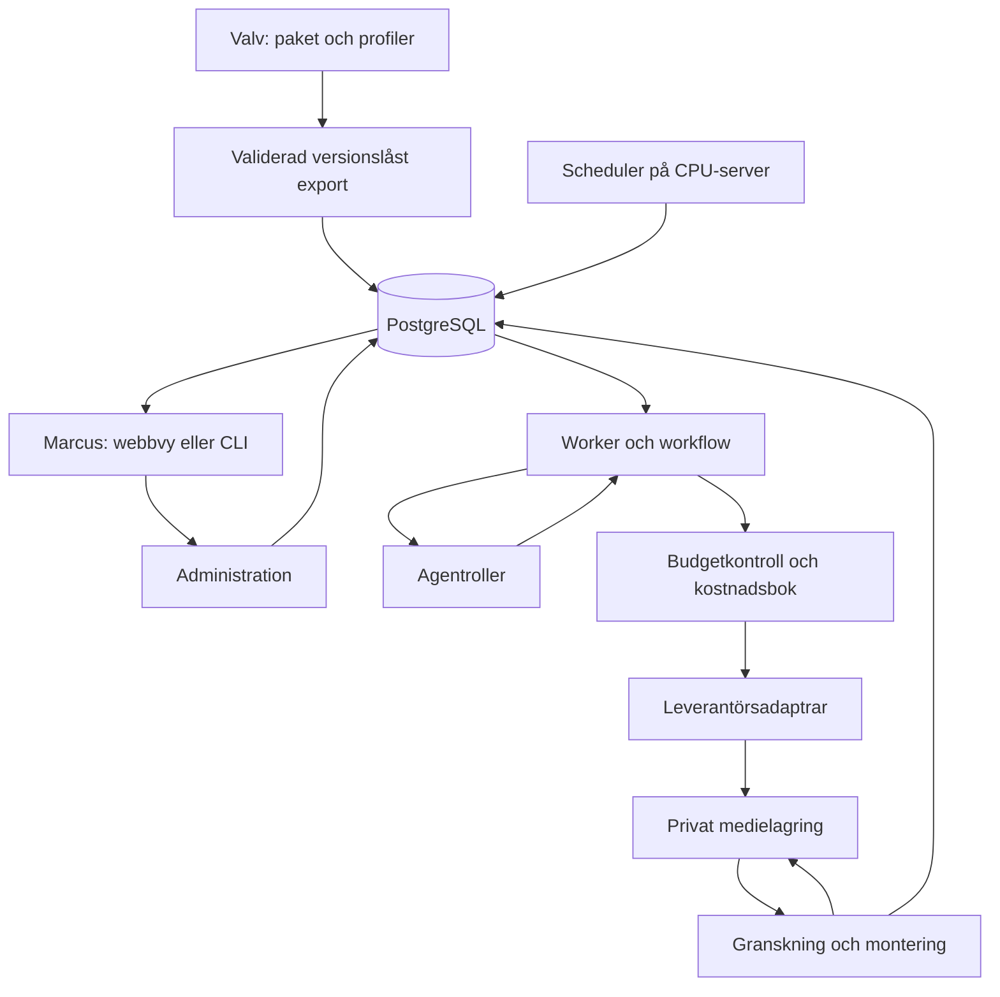

# Arkitektur

[Projektstart](Start.md) · B6: egna öppna vikter via ComfyUI i container på hyrd GPU är förstahandsspåret. Övriga teknikdetaljer är rekommendationer; inga tjänster är beställda.

## Komponenter och informationsutbyte

| Del | Ansvar och data som passerar gränsen |
|---|---|
| CharacterPack | Kanonisk persona, godkända referenser, röstpolicy, profilval; ger bara aktuell karaktär till jobbet |
| AgentProfile | Instruktion, input/output-kontrakt, verktygstillåtelse och modellpolicy; producerar kreativa förslag |
| ProductionProfile | Format, längd, kvalitetsgränser, export och maxförsök; inga personuppgifter |
| WorkflowDefinition | Ordnade steg och villkor; kod avgör om nästa steg får köras |
| Scheduler | Aktivt schema + tidslucka → unik jobbförfrågan med konfigurationsrelease |
| Databaskö/worker | Claim med lease → steg; sparar resultat och leverantörsbegäran före fortsatt körning |
| Databas/historik | Metadata, låsta konfigurationer, kanoniska beslut, producerat/godkänt/publicerat och kostnader |
| Adapter | Validerat anropsförslag → provider-request; svar → normaliserad status, asset och kostnadsunderlag |
| Lagring | Privata original och utdata med checksumma, medietyp, ursprung och rättighetsreferens |
| Kostnadsbok | Budgetkonto, reservation, debitering och avstämning; godkänner aldrig innehåll |
| FFmpeg/leverans | Godkända klipp, tidsatt röst och text → master/export; teknisk kontroll och manifest |

Agenten föreslår. Kod validerar typer, tillåtna assets, budget, kapabilitet, scenlängd, versioner och tillstånd. Marcus äger pengar, referensgodkännande, profilpromotion och publicering. Ingen LLM får flytta budgetgränsen eller direkt skicka en betald mediebeställning.

## Rekommenderad teknik och byteskriterier

| Val | Projektskäl | När valet omprövas |
|---|---|---|
| Python + FastAPI + Pydantic | Ett språk för medieintegration och kontrakt; FastAPI dokumenterar API och Pydantic validerar data. Mindre integrationsarbete än flera språk. [Officiell FastAPI](https://fastapi.tiangolo.com/features/), [Pydantic](https://docs.pydantic.dev/latest/concepts/models/), lästa 2026-09-12. | Om testad Python-/macOS-kombination inte stöds väljs stödd lokal eller avlägsen utvecklingsmiljö före installation |
| Modulär monolit | API, scheduler och worker delar kod men kör olika processer; tydliga domängränser utan många nätverkstjänster | Fler samtidiga arbetslaster eller tydliga isoleringsbehov |
| PostgreSQL och beständig jobbkö | Budget, tillstånd och unika nycklar i samma transaktion; låga antal jobb motiverar få drifttjänster | Köprototypen kräver mycket specialkod eller klarar inte återhämtning; utvärdera underhållen kö innan Redis eller fler tjänster införs |
| Explicit workflow i kod först; LangGraph som prototypkandidat | Kedjan är mest sekventiell och kostnadsrisk ligger i externa sidoeffekter. Prova checkpoints bara om de förenklar revision och resume | Välj LangGraph om samma avbrottstester blir enklare utan dubbla auktoritativa stegtillstånd |
| FFmpeg och ffprobe | Kontrollerad montering och maskinläsbar mediakontroll; inga AI-anrop för enkel klippning | CPU-montering blir mätt flaskhals; flytta monteringsworker separat |
| Privat S3-kompatibel objektlagring, R2 som kandidat | Media skiljs från databasen; adapter gör senare lagringsbyte möjligt | Åtkomstmönster, region, retention eller uppmätt totalkostnad talar för annat |
| Docker Compose på en CPU-VPS | Få tjänster för en operatör, enkel återställbar drift | Faktiskt behov av hög tillgänglighet; Kubernetes ingår inte som standard |
| Öppna bild-/videovikter via ComfyUI i container på hyrd GPU | B6: kontroll, möjlighet till låg kostnad/hög kvalitet och lärande om modeller, containers och drift. R: Qwen-Image-Edit-2511 → Wan2.2-TI2V-5B, se verifiering i Utvärdering | Om egna kvalitets-/kostnadsmätningar motiverar det provas större modell eller färdigt API genom samma adaptergräns |
| LLM- och TTS-adaptrar | Lås testad modell per uppgift; ElevenLabs är en röstkandidat, ingen vald röst | Naturlighet, rättigheter, pris och felutfall avgör; inga modellnamn förifylls som produktionsvinnare |

PostgreSQL dokumenterar `FOR UPDATE SKIP LOCKED` som användbart för köliknande åtkomst, med en inkonsistent vy som inte passar allmänna läsningar. Vår lease- och budgetdesign är en egen rekommendation, inte en färdig köfunktion. [PostgreSQL SELECT](https://www.postgresql.org/docs/current/sql-select.html), läst 2026-09-12.

LangGraph dokumenterar checkpoints för sparat graf­tillstånd. Det ersätter inte skyddet kring externa beställningar; vår databas för ProviderRequest och kostnadsbok förblir auktoritativ. [LangGraph persistence](https://docs.langchain.com/oss/python/langgraph/persistence), läst 2026-09-12. ffprobe kan ge strukturerad media- och ströminformation; vilka kontroller som räcker måste provas på våra exporter. [ffprobe](https://ffmpeg.org/ffprobe.html), läst 2026-09-12.

## GPU-spåret: interaktivt prov före automatisering

Första experimentet ägs av [Utvärdering](Utvärdering.md): officiella modell-/licenskällor, referensfiler, GPU-dimensionering, kostnadstak och testkort. Kommersiell användning av de föreslagna basmodellerna stöds av deras Apache-2.0-licenser; den faktiska imagen och dess beroenden kontrolleras separat. Lägre kostnad per användbart klipp är en hypotes som omfattar även start, modellinläsning, idle och fel.

E1 använder en tillfällig on-demand GPU-Pod med container och interaktiv ComfyUI. När scenkvaliteten är visad låses den fungerande miljön som image-digest, modellmanifest och exporterade UI-/API-workflows, och provas från ren start. E1 kräver ingen serverless-handler, full jobbkö eller CPU-server. Den externa GPU-container som piloten använder utvecklas senare till automatiskt anropad medieworker.

Den framtida ComfyUI-adaptern tar GenerationPlan och tillåtna assets, mappar parametrar till ett versionslåst API-workflow, journalför beställning, följer promptstatus och returnerar Asset/CostEntry. Hyrplattformens resurs-ID och ComfyUI:s prompt-ID hålls isär. Lagring utanför containern och kostnadsjournal behövs för resume. Färdiga medie-API-adaptrar behålls som jämförelse eller alternativ. Text och TTS har separata policies; ComfyUI-spåret kräver inte att allt körs på samma GPU.

Modellbyte innebär en kandidatversion av workflow, modellmanifest och vid behov adapter. Skillnader i VAE, encoder, noder, VRAM, referensformat och längd kan kräva ändringar och nya tester. Jobb behåller låst release, och rollback gäller nya jobb. Budget- och domänkontrakt återanvänds där de passar, men vi lovar inte friktionsfria byten.

## Datamodell och invarianta regler

Alla tabeller har internt ID, skapad/ändrad UTC-tid och schema-/payloadversion där struktur lagras. `character_id` följer jobbet till scen, historik och asset; alla läsningar verifierar denna tillhörighet. Delade researchposter kräver explicit scope `shared` och får inte bära en annan karaktärs privata kontext.

| Objekt | Minsta fält och relationer |
|---|---|
| ConfigRelease | release_id, source_hashes, pack/profile/workflow-versioner, approved_by/at, export_hash |
| Schedule | schedule_id, character_id, release_id, timezone, local_time, enabled, catchup_policy |
| ProductionJob | job_id, character_id, release_id, schedule_slot, status, cancellation_requested, budget_account_id |
| StepRun | job_id, step_id, input_hash, output_ref, status, lease_owner, lease_until, fencing_token, revision_count |
| Scene | scene_id, job_id, beat_ids, target_duration, outfit/location/continuity, selected_asset_ids |
| ProviderRequest | request_id, step_id, scene_id nullable, attempt, request_hash, idempotency_key nullable, provider_id nullable, state, reservation_id |
| Asset | asset_id, character_id/scope, object_key, sha256, type, parent_asset_ids, provider_request_id, rights_ref, validation_status |
| CostEntry | entry_id, request_id, type, amount_decimal, currency, sek_rate, rate_time, pricing_snapshot, invoice_ref nullable, certainty |
| Evaluation | evaluation_id, job/scene/asset_id, reviewer_version, rubric_version, scores, hard_fail_codes, human_decision nullable |
| ContentHistory | job_id, story_chapter, place, outfit, narrative_events, production_status, approval_status, publication_status, publication_url nullable |

Unikhet: schemajobb på `(schedule_id, character_id, production_profile_id, local_date, local_time)` enligt DST-policy; stegresultat på `(job_id, step_id, input_hash)`; försök på `(step_run_id, scene_id, attempt)`. Budgetbelopp är decimaler eller heltal i minsta valutaenhet, aldrig binär flyttalssummering.

R: worker claimar kort transaktion, uppdaterar lease, gör nätverksarbete utanför databaslåset. Heartbeat var 20 s och lease 120 s är testvärden. Fencing-token måste matcha när resultat skrivs: gammal worker får inte skriva över ny ägare. Utgången lease betyder inte att en extern beställning är ogjord. Ny worker avstämmer ProviderRequest före eventuell fortsatt körning.

## Ett konfigurationsoriginal

Valvets nya paket och instruktioner är det redigerbara originalet för motorutkasten. Skyddade karaktärsanteckningar förblir kreativa källor; de är inte en andra exekverbar konfiguration. Konflikter löses i ett dokumenterat paketbeslut med källhänvisning, aldrig genom tyst omskrivning av originalet.

Framtida exportkommando läser endast Content Engine-katalogens tillåtna konfigurationsdelar och explicit godkända källreferenser. Det validerar schema, path traversal/symlänkar, profilreferenser, versioner, referensrättigheter och aktiveringskrav. Därefter skapar det ett oföränderligt releasepaket utanför valvet med alla upplösta instruktioner och hash per källfil. Servern tar emot denna validerade kopia och importerar hela releasen atomiskt. Den läser aldrig halvredigerad Obsidian-text under ett jobb.

En release pekar tillbaka på källa/version/hash och får inte handredigeras på servern. Ändringar börjar i valvet, ger ny version, jämförs i utvärdering och exporteras igen. Ett pågående jobb behåller sin release. Akut stopp är operativt databastillstånd, inte en tyst profiländring. Upprepning av samma version med annan hash avvisas. Driftresultat skrivs i databasen; sammanfattningar kan exporteras som nya rapporter i valvet utan att skriva över personlighet eller instruktioner.

Framtida kod kan ligga i `src/content_engine/{domain,orchestration,providers,media,persistence,api}` i reporoten med `tests`, `evals` och `infra` bredvid. Inget av detta skapas som körbar implementation i denna etapp.
