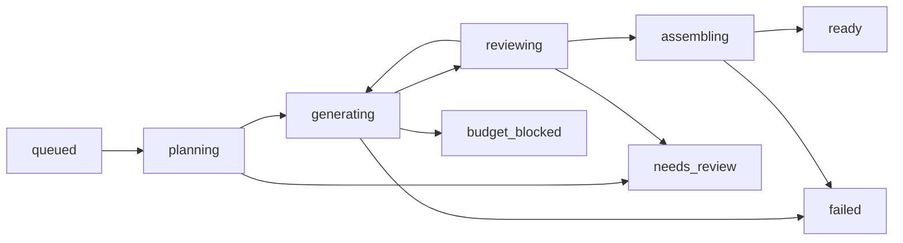

# Workflows

[Projektstart](Start.md) · R: `influencer_voiceover_v1@0.1.0`, inaktivt definitionsutkast.

## Produktionsprofil

`vertical_short_v1@0.1.0`: 15–30 s, mål 20 s, 9:16, export 1080×1920, föreslagen 30 fps, 3–5 scener, voiceover en-US, ingen synlig dialog, ingen musik som standard. Genereringens upplösning/fps bestäms först av testad modell; metadata måste redovisa uppskalning eller konvertering. Export i hög upplösning är inte i sig kvalitetsbevis.

Budgetfält har inga godkända belopp. Försöksgränser som föreslås: en strukturrättning per agentsteg, en kreativ manusrevision per jobb, första försöket plus högst två ytterligare försök per bild respektive videoklipp och scen, ett ytterligare röstförsök. Budget kan stoppa tidigare. Byte av bild ogiltigförklarar dess beroende videoklipp och nollställer inte försöksräknarna.

## Steg, kontrakt och kontrollpunkter

Alla utdata sparas innan beroende steg får börja. Ett StepRun bär input-hash, låst profil, status och output-referens enligt [Arkitektur](Arkitektur.md). Följande tabell är huvuddefinitionen av ordningen; rollernas payloadfält finns i [Agenter](Agenter.md).

| Steg | Behöver → producerar | Validering och sparat resultat | Fortsättning, fel och kostnad |
|---|---|---|---|
| 0. Trigger | Manuellt startkommando eller unik schemalucka + aktiv release → queued jobb | Konfiguration, rättigheter, budgetfält, schemaunikhet; låst snapshot | Inaktivt paket avvisas; ingen kostnad. Hela jobbets godkända maxram reserveras enligt kostnadsboken |
| 1. Research | Kontext, nisch, cache → ResearchBundle | Käll-ID, URL/datum, fakta/inspiration; spara researchhash och cacheursprung | Evergreen tillåts vid källbrist. Sök/LLM dras ur jobbramen; blockera om aktuell research krävs |
| 2. Idé | ResearchBundle + historik → ContentBrief | Vald kandidat finns, format/längd/claims stämmer; brief sparas | Ej verifierade fakta tas bort eller blockerar; bara textkostnad hittills |
| 3. Manus | ContentBrief → Script | Beat-ID, språk, uppskattad längd; Reviewer vid stage=script | En kreativ revision, sedan needs_review/failed beroende på osäkerhet eller definitivt fel |
| 4. Regi | Script + referenser → ScenePlan | Alla beats täcks, giltiga referenser, kläder/plats/handling; scener sparas | Saknad identitet stoppar före mediakostnad |
| 5. Produktionsplan | ScenePlan + kapabiliteter → GenerationPlan | Kod löser modell och kontrollerar längd, ratio, ljud, referensantal och kostnadsövre gräns; spara anropsförslag/prissnapshot | Ej stödd begäran blockeras; agenten reserverar inte pengar |
| 6. Bilder och röst | GenerationPlan + Script → bilder, röstasset, timed_transcript | Spara ProviderRequest före nätverk, asset-hash efter nedladdning; röst mäts och transkript tidsätts via stödd alignment eller testad lokal metod | Kan köras parallellt, men initial max samtidiga betalda anrop är 1. Varje anrop tar en del av jobbramen |
| 7. Bild-/röstkontroll och timing | Bilder/röst + referenser → Review och Timeline | Godkänd identitet före video. Faktisk röstlängd 15–30 s; beat-tider mappas till scener, ingen gissad SRT | Underkänd bild görs om scenvis. Lång röst → tillåten manusrevision och nytt röstförsök eller stopp; andra färdiga assets behålls där input inte ändrats |
| 8. Video | Godkänd bild + klipplan + Timeline → scenklipp | Längd stöds; källbild/hash och request-ID sparas; klippljud kasseras | Generera erforderlig stödd längd; betala hela längden, trimma till Timeline. Saknas bildgodkännande får ingen videobeställning ske |
| 9. Scenkontroll | Klipp + bild/persona + rubric → Review | Identitet, rörelse, händer och kontinuitet med faktisk medietäckning | Fail → bara berörd scen inom kvarvarande försök/pengar; uncertain → needs_review |
| 10. Montering | Alla godkända klipp + Timeline + röst → master.mp4 och final.mp4 | FFmpeg monterar; ffprobe kontrollerar duration, bildstorlek, fps och ljudström. Spara monteringsrecept/hash; extrahera omslagskandidater från godkända frames och låt slutgranskningen godkänna dem | Saknat asset hämtas igen om det finns hos provider; annars tydligt fel, ingen dold omgenerering |
| 11. Slutgranskning | Slutvideo + teknisk rapport → Review | Manusvärde, ljud, synk, kontinuitet och inga hårda fel | Exportfel rättas genom ny montering. Innehållsfel återförs till berörd scen med beroenden; budget/attempt kvarstår |
| 12. Paketering | Godkänd slutvideo + timed_transcript → PackageCopy och leveranspaket | Kod skriver SRT/post-copy/manifest, verifierar filer och checksummor; atomisk publicering av paket i privat lagring | Metadatafel rättas utan ny generering. ready först efter komplett paket; outnyttjad jobbram släpps när okända beställningar är avstämda |

Timeline är kodens strukturerade utdata: `{voice_asset_id, total_seconds, scenes:[{scene_id, start_seconds, end_seconds, source_trim_start}], captions:[{start_seconds,end_seconds,text}]}`. Röstens uppmätta längd styr tidsplanen även i voiceover; några tysta pauser får ingå. Scenernas intervall ska vara sammanhängande, utan oavsiktliga glapp, och rymma sin röst. Tekniska toleranser föreslås till högst en bildruta mellan planerad och exporterad klippgräns, och textning inom 0,25 s av talet vid manuell kontroll. Dessa toleranser ska provas.

## Jobbtillstånd och resume

Diagrammet visar huvudvägen. Alla icke-terminala tillstånd kan gå till `cancelled` efter operatörsstopp, `budget_blocked` vid saknad ram eller `failed` vid permanent fel. `needs_review` är paus för osäker bedömning eller okänt providerutfall. Operatörsåtgärd återför ett pausat jobb till dess första ofärdiga steg, utan att ändra låst konfiguration. `ready`, `failed` och `cancelled` är terminala produktionsstatusar; kostnadsavstämning kan fortsätta efteråt. Ny körning får nytt jobb-ID med parent_job_id om konfigurationen ska ändras.

Stegstatus: pending, running, succeeded, needs_review, failed, skipped. ProviderRequest har separat prepared, submitted, running, succeeded, failed, unknown, cancelled. Alla försök och alla kostnader är kvar. Ett jobb kan vara cancelled och ändå ha debiterad produktion.

Efter omstart: claima jobbet med ny lease/fencing-token; kontrollera nödstopp; läs senaste steget och alla prepared/unknown/submitted-anrop; fråga leverantörens status när ett ID finns. Återanvänd succeeded-steg endast om input-hash och asset-checksumma stämmer. Saknad fil med känd objektkälla hämtas igen. Ingen ny beställning baseras enbart på att en worker dog. Exakt policy för okänt anropsutfall finns i [Drift och kostnader](Drift%20och%20kostnader.md).

## Abby från idé till paket – illustrativt exempel

Detta är en genomgång av planerat beteende, inte utförd produktion. Tänk att Marcus senare har godkänt referenser, röst och en experimentram. Jobbet `demo-abby-001` skapas för den inaktiva profilens framtida aktiverade release. Ingen sådan release finns nu.

Research saknar aktuell trend och returnerar en uttrycklig evergreen-inspiration om semesterstil. Planner jämför tre idéer och väljer “Dinner outfit at breakfast”, med tittarvärde i självironi plus en korallaccent. Ingen faktisk hotellvistelse påstås. Manusets fyra beats och engelska taltext finns i Writer-exemplet i Agenter.

| Scen | Illustrativ tid | Bild och rörelse | Kontinuitet |
|---|---|---|---|
| s1 | 0–5 s | Abby i elegant linneklänning på fiktiv terrass, liten vändning | Godkänt ansikte, creme, korallaccent, morgonljus |
| s2 | 5–10 s | Halvnära lugn reaktion vid frukostbord, munnen i vila | Samma outfit och plats, ingen koppkontakt |
| s3 | 10–15 s | Något bredare pose med frukostmiljön i bakgrunden | Samma smycken och klänning |
| s4 | 15–20 s | Korallaccessoar tydligt synlig, tillbaka till ansiktsreaktion | Ingen ny produkt eller outfit introduceras |

Fyra bilder granskas. Anta illustrativt att s2 får fel hand: bara s2-bilden görs om, och kostnaden från första försöket stannar i boken. Röst skapas separat; om den mäts till 21 s justerar kod Timeline och kontrollerar om modellens klipplängder räcker innan video beställs. Alla videoklipp ska använda godkända bilder. Om s1 får ansiktsdrift vid 2,4 s föreslår Reviewer minskad huvudvridning; kod kontrollerar återstående försöks- och kostnadsram före omtagningen.

Efter godkända klipp monteras en ren master, vald slutexport och tidsatt undertext. Penny skapar “Breakfast with ambition” och beskriver miljön som fiktiv. Manifestet binder ihop varje försök, modellversion, källa, uppskalningsstatus och kostnadssäkerhet. Jobbet blir ready, Marcus granskar och laddar ned. Först efter manuell uppladdning registreras publication_status=published med faktisk länk och datum.

## Senare workflows

Voiceover är berättarröst över scener utan krav på talande mun. Läppsynk betyder synligt tal vars munrörelser måste matcha det faktiska ljudet. Att lägga en vald röst på ett redan talande ansikte löser inte detta. `dialogue_lipsync` måste välja antingen ljudstyrd ansiktsgenerering eller separat verifierad synkning; röst och ljudtider låses före munanimation och både uttal, timing och ansiktslikhet granskas.

Smink kräver kontaktytor/händer och trovärdig applicering. Dans kräver längre sammanhängande rörelse och kroppskontroll. Flera personer kräver isolerade identiteter. Reklam kräver exakt produktlikhet och verifierade claims. Mason behöver verkliga skärmdemos. Varje gren får eget workflow-ID, kapabilitetskrav, budgettest och kvalitetsgrind; ingen av dem aktiveras genom att lägga till en prompt i voiceoverflödet.
